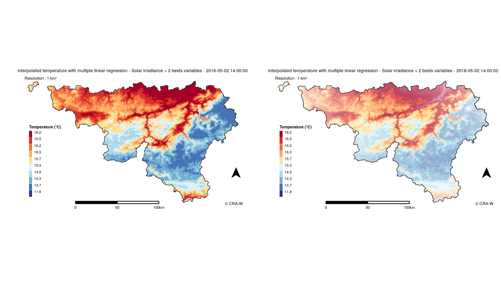

```{r include_packages_ch5, include = FALSE}
# This chunk ensures that the thesisdown package is
# installed and loaded. This thesisdown package includes
# the template files for the thesis and also two functions
# used for labeling and referencing
library(devtools)
devtools::install_github("haozhu233/kableExtra")
library(kableExtra)
load("./data/env_report.RData")
```


<!-- And then, I aggregated, by calculating the mean, all the hourly performance measures to choose the method that globally performs the best. For each desired hourly dataset, I applied the choosen method to build a model to make spatial predictions. The predictions and their uncertainty have been vizualized using maps. -->

# Results and discussion {#results}

## Benchmark

### Methodology

In the case of the project, a benchmark is an analysis where the objective is to compare and rank the different combinations of tasks and learners.

To realize this benchmark, data from 2015-11-11 00:00:00 to 2018-06-30 00:00:00 were used. The objective is to run a benchmark on 5 years of data but at this moment, solar irradiance data from EUMETSAT were not available before this date. Here, the dataset has 23089 hours.

&nbsp;

The learners were defined with filter methods implemented in `mlr`. These filter methods are applied to a statistical algorithm (multiple linear regression) to choose explanatory variables using conditions. The different conditions used to filter explanatory variables are the following :

- for each hourly dataset, linear correlation with temperature is computed for every explanatory variable. Other filter methods are available (chi-squared, anova...) but linear correlation seems to be the most relevant one for a regression problem.
- then, explanatory variables are kept according to conditions : variables with the best hourly linear correlation with temperature (the number of variables to keep is specified) or all the variables which have a linear correlation greater than a value from 0 to 1.
- I can also choose explanatory variables that I want to build models regardless of their linear correlation

All these filter methods where applied to **Multiple Linear Regression** learner in the case of my internship.

&nbsp;

The Table \@ref(tab:explvar) shows the different combinations compared using filter methods.

&nbsp;

The benchmark performs for every hour and filter methods are applied each time. As a consequence, linear correlation computation is hourly done and `mlr` choose automatically the variables using the filter methods. Then, based on this hourly computation, the combination of explanatory variables can be different from one hour to another.

&nbsp;

The benchmark took about 30 hours, i.e. 3 hours per method. Computations are very long and results are very large. Each method represents more than 1 Gigabyte of data.

```{r explvar, echo=FALSE}
explvar = data.frame(Statistical_Method = c("Multiple Linear Regression", "Multiple Linear Regression", "Multiple Linear Regression", "Multiple Linear Regression", "Multiple Linear Regression", "Multiple Linear Regression", "Multiple Linear Regression", "Multiple Linear Regression", "Multiple Linear Regression", "Multiple Linear Regression"),
                     ID = c("lm.Long.Lat", "lm.Long.Lat.Elev", "lm.SolIrr+1bestVar", "lm.SolIrr+2bestsVar", "lm.SolIrr+3bestsVar", "lm.2bestsVar", "lm.3bestsVar", "lm.4bestsVar", "lm.Vars.r>0,5", "lm.Vars.r>0,3"),
                     Explanatory_Variables = c("Longitude & Latitude", "Longitude & Latitude & Elevation", "Solar Irradiance & best variable based on an hourly linear correlation computation", "Solar Irradiance & 2 best variables based on an hourly linear correlation computation", "Solar Irradiance & 3 best variables based on an hourly linear correlation computation", "2 best variables based on linear correlation computation for every hour", "3 best variables based on linear correlation computation for every hour", "4 best variables based on linear correlation computation for every hour", "Variables with a linear correlation greater than 0.5", "Variables with a linear correlation greater than 0.3"))
colnames(explvar) <- c("Statistical Method", "ID", "Explanatory variables")
knitr::kable(explvar, caption = "Combination of explanatory variables used") %>%
  kable_styling(latex_options = "scale_down") %>%
  row_spec(0, bold = TRUE)
```

### Comparison of methods

Once benchmark results are available, comparison of methods is possible. This comparison is based on the error of measures. In our case, RMSE and MAE were computed because they both express average model prediction error in units of the variable of interest. Both metrics can range from 0 to $\infty$ and are indifferent to the direction of errors. They are negatively-oriented scores, which means lower values are better.

Since the errors are squared before they are averaged, the RMSE gives a relatively high weight to large errors. This means the RMSE is more useful because large errors are particularly undesirable in the project. (Chai, 2014)

&nbsp;

From the 10 methods compared, MAE and RMSE are computed and compared. The results are shown in the Figure \@ref(fig:meanerror). In this case, they both have the same behaviour. Indeed, they both return the same ranking of the methods and they both show methods which stand out from the other ones.

Multiple linear regression using coordinates to build models has a large error, this combination is not relevant to spatially predict temperature in Wallonia. Multiple linear regression using explanatory variables whose their linear correlations with temperature is greater than 0.3 has an error larger than the other methods too, this filter method is too flexible to return valid spatial predictions. A few methods have a similar error. In particular, that is the case when too many variables are chosen to build models.

&nbsp;

Among the three best methods, one is better than the others. This is the models built from an equation using longitude, latitude and altitude as explanatory variables. Tests realized on two months of data have already shown that altitude is a powerful explanatory variable. The two other methods are based on the hourly computation of the linear correlations with temperature, with or without solar irradiance as mandatory variable and keeping the 2 other best variables have a similar error. However, in spite of their larger error, they can be interesting because the equation is dynamic throughout hours and, in this way, the models are adapted to the evaluated hour.

```{r meanerror, echo=FALSE, fig.cap="Errors (RMSE and MAE) of methods", out.width="100%", fig.align='center'}
include_graphics(path = "figure/meanerror.png")
```

Errors are between 0.72 and 0.91 for MAE and between 0.93 and 1.20 for RMSE. These errors should be near zero. Both of MAE and RMSE are expressed in degrees such as temperature. An error of 1 degree is relatively important and has to be taken into consideration.

&nbsp;

Performances of methods can be compared computing their rank for each hour. The Figure \@ref(fig:barchart) compares the three best methods :

- the 2 variables with the best hourly linear correlation with temperature
- longitude, latitude and elevation
- solar irradiance and the 2 variables with the hourly best linear correlation with temperature

This barchart corroborates the precedent graph. The method based on coordinates and elevation is widely better than the two others which are more similar but with a relevant difference. The ranks $1.5$ and $2.5$ correspond to cases where two methods have exactly the same error for a same task.

```{r barchart, echo=FALSE, fig.cap="Comparison of methods by rank", out.width="100%", fig.align='center'}
include_graphics(path = "figure/barchart.png")
```

For each hour, the equation of the model is computed. They can be extracted from the benchmark. The Table \@ref(tab:models) shows the structure of the equations in the case where explanatory variables can be different from one hour to another (lm.2bestsVar). The table also shows what are the best variables and display the related error.

```{r models, echo=FALSE, fig.cap="Models with their equations"}
knitr::kable(models.sample, caption = "Models with their equations") %>%
  kable_styling(latex_options = "scale_down") %>%
  row_spec(0, bold = TRUE)
```

### Visualization

These models can be observed on maps. For that purpose, functions building maps have been made with ggplot2 library from R for static maps and leaflet library for interactive maps.

Models built from physical stations data are applied to the 1 km² grid cells. Then, the temperature is mapped with a color palette similar to the one of RMI. Class breaks are based on quantiles of temperature values. Standard error is computed for each cell and it is shown on the map with a white layer which has different levels of transparency according to the error. A large standard error is related to an opacity and vice-versa.

The Figure \@ref(fig:map) shows an output for one hour based on the method where explanatory variables are Solar irradiance and the 2 variables with the best linear correlation with temperature. To build this map, some objects are needed : an object containing data (temperature and standard error) for the grid and a spatial vector object containing boundaries of Wallonia, but also the name of the variable to display. Then, some conditions can be chosen, like the display of the layer containing error, the display of the legend for error, the way to build the legend and its classes. Some arguments enable to customize the map with titles and comments. The function is thus reusable for other usages. For example, the function builds maps spatializing hydric deficit in Wallonia.

The choice I made was to use quantiles to make class breaks because that is more relevant than homogeneous breaks.

The figure shows 2 maps. The one on the left is the map with spatialization of temperature, the right one has the layer with error on the temperature layer. It is possible to see regions where errors are more important.

```{r map, echo=FALSE, fig.cap="Example of an output for 2018-05-02 14:00:00 (left : without error ; right : with error)", out.width="100%"}

```

This figure shows the output based on a model depending on the method where explanatory variables are Solar irradiance and the 2 variables with the best linear correlation with temperature, the equation of the model is the following one :

\[
T = 15.59716 + -0.00629 \times Elevation + -0.00197 \times Herbaceous + 0.00206 \times SolarIrradiance
\]

These maps show whether the models are relevant. The _Appendix B_ shows maps made with all methods for one hour. These maps show differences in the relevance of each model. For example, the model depending on longitude and latitude is very simplistic compared to the others. The other models are more similar but show that some of them are more reliable because the error is smaller. The better model is the second one on the first row. It is corresponding to the the model depending on longitude, latitude and elevation. For this hour, the better model is the following :
\[
T = -9.375042 + -0.010431 \times Elevation + 1.02e-05 \times Longitude + 1.59e-05 \times Latitude
\]

Longitude and latitude are expressed in meters because the CRS used is Belgian Lambert 2008. That is why their coefficients are about 1$e$-05. For information, values of the coordinates are about 6$e$06.

## Discussion

As a reminder, the objective of the project is to provide weather predictions. These predictions will feed decision support tools to monitor crop diseases like potato late blight and to operate in fields at the right times.

```{r rmi, echo=FALSE, fig.cap="Precipitations, temperatures and insolation, annual values", out.width="100%", fig.align='center'}
include_graphics(path = "figure/rmi_climate_data.png")
```

Results have some limits that have to be discussed. The first limit is the period used to build models. Indeed, models were built with data from 2 and a half years. This period could be too short to be relevant. Moreover, this period is not necessarily representative of a mean period. According to RMI, 2015, 2017 and 2018 are hot and dry years compared to normal year, 2016 were a wet year. This is shown on the Figure \@ref(fig:rmi).

&nbsp;

Even if visualization of outputs is not the main objective of the project, the choice I made to compute class breaks with quantiles can be discussed. In the case of temperature, that seems relevant but other methods exist.

&nbsp;

Models were built with some explanatory variables but they may be insufficient. Adding new variables like temperature predictions from RMI could improve models. Only 27 stations are used to build these models, adding RMI stations network could be a solution to improve models too. However, weather stations from different networks have differences in their measures, checking interoperability is very important for that and making corrections is essential.

&nbsp;

Multiple linear regression is the only statistical method used to build models, but going forward, other methods will be compared like ANN and different kriging methods. The major constraint will be time computation which is relatively long. There is a lot of possible combinations of explanatory variables to compare, choices must be done because of the time computation. These choices sometimes can be subjective and not based on scientific literature.

&nbsp;

Beyond these limits, other points can be discussed. Solar irradiance data are provided by EUMETSAT and by PAMESEB stations. These data have to be compared because both sources are used. Data from stations are used to build models, data from EUMETSAT for spatialization. To do this comparison, I have searched for the nearest point of record from EUMETSAT to each PAMESEB station. Then, I compared each couple on the period where I realised the benchmark. This comparison shows a correlation around 0.95. As a consequence, there is nothing wrong with it.

&nbsp;

The ranking of the methods show that the method using the hourly 2 best variables provides a smaller error than the same method adding solar irradiance in every task. That is interesting because intuitively, adding an explanatory variable should reduce the error. I noticed that solar irradiance provides a large error for a few tasks, that might explain these results.

&nbsp;

With the aim to provide data for agronomic utilisation, there is an interest to compare mean error observed in Wallonia and this error in agricultural areas to be sure of the accuracy of predictions. That has not be done yet.

&nbsp;

Assuming that no other models will be better than those presented, there will be a question of transparency for the project. In that way, models will be clearly presented. If one static model is chosen for predictions, this will be clear and transparent. But if the chosen method is a dynamic one, using computation every hour, the method used for each hour could be different, and that will have to be mentioned.
